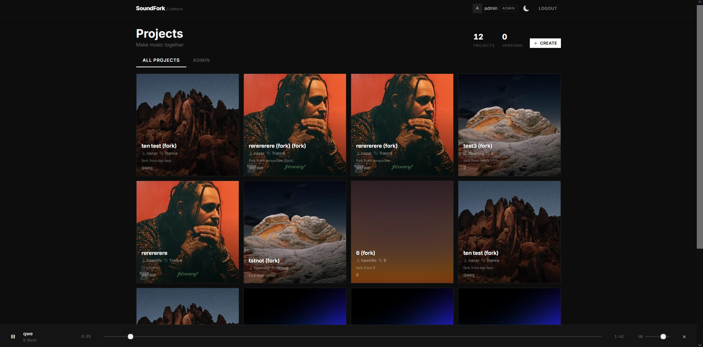
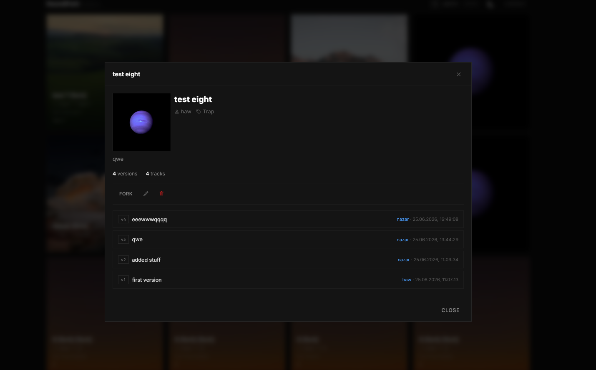
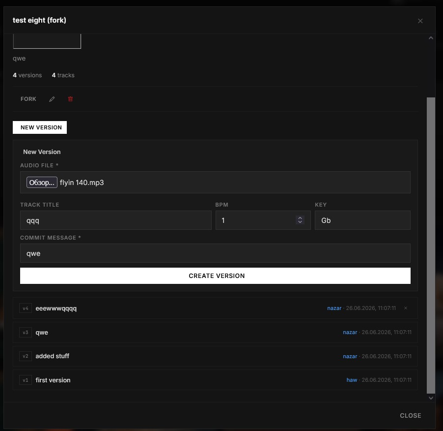
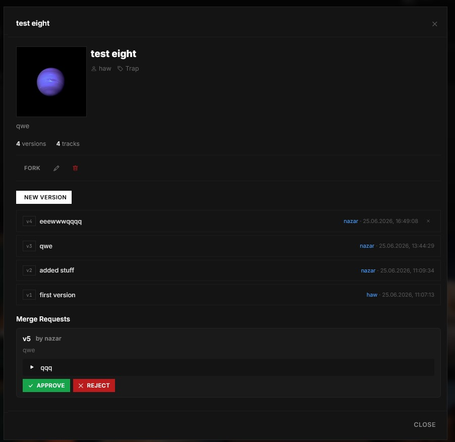

# SoundFork

A collaborative music production platform. Create projects, upload tracks, manage versions, fork other people's projects, and submit merge requests to combine your work.

Built with **Spring Boot 3.5**
## Screenshots

<details>
<summary>Click to view screenshots</summary>

<p align="center">
  <a href="screenshots/main.jpg"></a>
  <a href="screenshots/project-detail.jpg.png"></a>
</p>
<p align="center">
  <a href="screenshots/new-version.jpg"></a>
<a href="screenshots/approve-reject.jpg"></a>
</p>

</details>

---

## Stack

| Layer | Technology |
|---|---|
| Backend | Java 17, Spring Boot 3.5, Spring Security, Spring Data JPA, Hibernate 7 |
| Database | PostgreSQL 17 (main + notifications) |
| Cache | Redis 7 (10-min TTL) |
| Messaging | Apache Kafka, Zookeeper |
| Auth | JWT (HMAC-SHA256) |
| API | REST, SpringDoc OpenAPI (Swagger UI) |
| Build | Maven, Lombok |
| Frontend | Vanilla JS, CSS  |
| Infrastructure | Docker  |

---

## Architecture

```
┌──────────────────────┐         ┌─────────────────────────┐
│   SoundFork App      │  Kafka  │   Notification Service  │
│   (:8080)            │────────▶│   (:8081)               │
│                      │◀── REST │                         │
└──────────┬───────────┘         └────────────┬────────────┘
           │                                  │
           ▼                                  ▼
┌──────────────────────┐         ┌─────────────────────────┐
│   PostgreSQL (main)  │         │   PostgreSQL (notifs)   │
│   soundfork DB       │         │   soundfork_notifs DB   │
└──────────────────────┘         └─────────────────────────┘
           │
           ▼
┌──────────────────────┐
│   Redis 7            │
│   (project cache)    │
└──────────────────────┘
```

---

## Features

- **User management** — registration, login, JWT-based auth, role-based access (USER/ADMIN), avatar upload with auto-resize
- **Projects** — CRUD with cover images, pagination, Redis-cached listing
- **Tracks** — upload/download audio files (mp3, wav, flac, ogg, aac, wma, m4a)
- **Versions** — snapshot-based versioning: each version captures the exact set of tracks at a point in time, with parent-version tracking
- **Merge requests** — propose changes from one project to another; approval automatically copies the source version and all its tracks into the target project
- **Notifications** — event-driven via Kafka, dedicated microservice with its own database
- **Email** — SMTP-based notifications on registration and merge request approval (Gmail)
- **Caching** — Redis-backed project listing with automatic eviction on state-changing operations (create, update, delete, fork, version changes, merge approvals)
- **Audio player** — in-browser playback of uploaded tracks
- **Dark theme** — custom CSS variables, smooth dark-only UI

---
## Quick Start

### Prerequisites

- [Docker Desktop](https://www.docker.com/products/docker-desktop/) (Windows/Mac) or Docker + Compose (Linux)

### Setup & Run

```bash
# 1. Clone
git clone https://github.com/nazarhovar/SoundFork.git
cd SoundFork

# 2. Create .env (optional — needed only for email notifications)
cp .env.example .env

# 3. Build and start everything
docker compose up -d --build
```

Open **http://localhost:8080** after waiting 1-2 minutes.

### First steps

1. Register a new account
2. Create a project
3. Upload a track (mp3, wav, flac, ogg, aac, wma, m4a)
4. Create a version to save the current state
5. Fork another project and create a merge request

### Stop

```bash
docker compose down
```

---

## API Overview

| Method | Path | Description |
|--------|------|-------------|
| `POST` | `/auth/register` | Register a new user |
| `POST` | `/auth/login` | Login, receive JWT |
| `GET` | `/users` | List users (admin) |
| `POST` | `/users` | Create user (admin) |
| `GET` | `/projects` | List projects (paginated, cached) |
| `POST` | `/projects` | Create project |
| `PUT` | `/projects/{id}` | Update project |
| `DELETE` | `/projects/{id}` | Delete project |
| `POST` | `/projects/{id}/fork` | Fork project |
| `GET` | `/projects/{id}/tracks` | List project tracks |
| `POST` | `/projects/{id}/tracks` | Upload track |
| `GET` | `/projects/{id}/versions` | Version history |
| `POST` | `/projects/{id}/versions` | Create version |
| `POST` | `/projects/{id}/merge-requests` | Create merge request |
| `POST` | `/merge-requests/{id}/approve` | Approve merge request |
| `POST` | `/merge-requests/{id}/reject` | Reject merge request |
| `GET` | `/notifications` | Get notifications |

Full API docs at `/swagger-ui.html` when running.

---

## Project Structure

```
src/main/java/com/SoundFork/SoundFork/
├── auth/             JWT auth (filter, util, controller, service)
├── config/           Security, Redis, JPA, app config
├── common/           Shared DTOs, enums, email, exceptions, image utils
├── user/             Users (entity, controller, service)
├── project/          Projects (entity, controller, service, fork logic)
├── track/            Tracks (entity, controller, service, file upload)
├── version/          Versions (entity, controller, service, track snapshots)
├── mergerequest/     Merge requests (entity, controller, service, approval)
├── notification/     Kafka event producer, REST proxy
└── SoundForkApplication.java

notification-service/   Microservice for notifications
├── src/                Spring Boot app, DB, Kafka consumer
└── Dockerfile

docker-compose.yml      All services (DB x2, Redis, Kafka, ZK, soundfork, notification-service)
```

