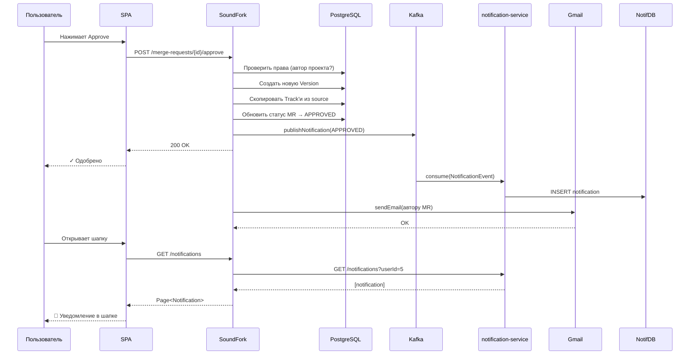
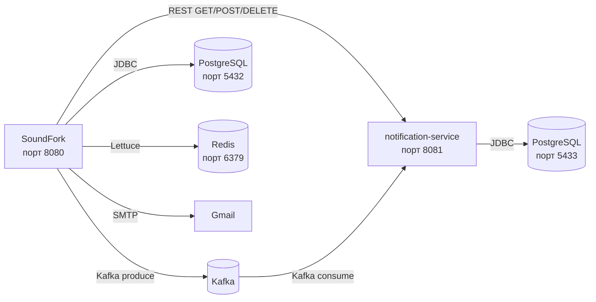

# SoundFork Architecture

## System Overview

```mermaid
graph TB
    User((Пользователь<br/>браузер))
    Frontend[SPA index.html<br/>vanilla JS + CSS]

    subgraph "SoundFork (порт 8080)"
        Security[JWT Filter]
        Auth[AuthController]
        Users[UserController]
        Projects[ProjectController]
        Tracks[TrackController]
        Versions[VersionController]
        MergeRequests[MergeRequestController]
        Notifications[NotificationController]
        Covers[CoverController]
        EmailSrv[EmailService]
        EventPub[EventPublisher<br/>Kafka Producer]
    end

    subgraph "notification-service (порт 8081)"
        KafkaConsumer[Kafka Consumer]
        NotifService[NotificationService]
        NotifDB[(PostgreSQL<br/>soundfork_notifications)]
    end

    subgraph "Infrastructure"
        Redis[(Redis<br/>кэш проектов)]
        MainDB[(PostgreSQL<br/>soundfork)]
        Kafka[(Kafka<br/>notification.topic)]
        Disk[Файловая система<br/>uploads/]
    end

    User --> Frontend
    Frontend -->|fetch()<br/>Authorization: Bearer| Security
    Security -->|authenticated| Auth
    Security -->|authenticated| Users
    Security -->|authenticated| Projects
    Security -->|authenticated| Tracks
    Security -->|authenticated| Versions
    Security -->|authenticated| MergeRequests
    Security -->|authenticated| Notifications
    Security -->|authenticated| Covers

    Auth -->|register/login| MainDB
    Users -->|CRUD| MainDB
    Projects -->|CRUD + fork| MainDB
    Projects -->|@Cacheable / @CacheEvict| Redis
    Tracks -->|upload/download| MainDB
    Tracks -->|read/write| Disk
    Versions -->|CRUD| MainDB
    MergeRequests -->|create/approve/reject| MainDB
    MergeRequests --> EventPub
    MergeRequests --> EmailSrv

    Notifications -->|GET/POST/DELETE| NotifService
    EventPub -->|JSON message| Kafka
    Kafka -->|consume| KafkaConsumer
    KafkaConsumer --> NotifService
    NotifService --> NotifDB
```

## Backend Package Structure

```mermaid
graph TD
    subgraph "src/main/java/com/SoundFork/SoundFork/"
        A[auth]
        C[config]
        CM[common]
        MR[mergerequest]
        N[notification]
        P[project]
        T[track]
        U[user]
        V[version]
    end

    subgraph "auth/"
        A1[AuthController<br/>POST /auth/register<br/>POST /auth/login]
        A2[AuthService]
        A3[JwtUtil<br/>HMAC-SHA256]
        A4[JwtFilter<br/>OncePerRequestFilter]
    end

    subgraph "config/"
        C1[SecurityConfig<br/>CSRF off, STATELESS]
        C2[RedisConfig<br/>TTL 10min, JSON serializer]
    end

    subgraph "common/"
        CM1[EmailService<br/>Gmail SMTP]
        CM2[PageResponse]
        CM3[GlobalExceptionHandler]
        CM4[ImageUtils<br/>resize/crop]
        CM5[MigrationRunner]
        CM6[enums: Role, ProjectStatus, MergeRequestStatus]
    end

    subgraph "project/"
        P1[ProjectController]
        P2[ProjectService<br/>@Cacheable@CacheEvict]
        P3[ProjectRepository]
        P4[Project]
        P5[dto: CreateProject, ProjectResponse, UpdateProject]
    end

    subgraph "version/"
        V1[VersionController]
        V2[VersionService]
        V3[VersionRepository]
        V4[Version, VersionTrack]
    end

    subgraph "track/"
        T1[TrackController]
        T2[TrackService]
        T3[TrackRepository]
        T4[Track]
    end

    subgraph "mergerequest/"
        MR1[MergeRequestController]
        MR2[MergeRequestService]
        MR3[MergeRequestRepository]
        MR4[MergeRequest]
    end

    subgraph "notification/"
        N1[NotificationController]
        N2[NotificationService<br/>REST proxy to :8081]
        N3[EventPublisher<br/>Kafka producer]
        N4[dto: NotificationPageResponse]
    end

    subgraph "user/"
        U1[UserController]
        U2[UserService]
        U3[UserRepository]
        U4[User]
    end

    A1 --> A2
    A2 --> A3
    A4 --> A3

    P1 --> P2
    P2 --> P3

    V1 --> V2
    V2 --> V3

    T1 --> T2
    T2 --> T3

    MR1 --> MR2
    MR2 --> MR3

    N1 --> N2
    N2 --> N3

    U1 --> U2
    U2 --> U3
```

## Request Flow: Merge Request Approval



## Database Schema

```mermaid
erDiagram
    User ||--o{ Project : "author"
    Project ||--o{ Track : "contains"
    Project ||--o{ Version : "has"
    Project ||--o| Project : "source fork"
    Version ||--o{ VersionTrack : "snapshot"
    Track ||--o{ VersionTrack : "included in"
    Version ||--o| Version : "parent"
    Project ||--o{ MergeRequest : "target"
    Version ||--o| MergeRequest : "source"
    User ||--o{ MergeRequest : "author"

    User {
        Long id PK
        string username UK
        string email UK
        string password BCrypt
        enum role USER | ADMIN
        string bio
        string avatarPath
        string socialLinks
    }

    Project {
        Long id PK
        string title
        string description
        string genre
        string coverArtPath
        Long author_id FK
        Long source_project_id FK nullable
        datetime forkedAt nullable
        datetime createdAt
        datetime updatedAt
    }

    Track {
        Long id PK
        string title
        Long project_id FK
        string filePath
        Long fileSize
        string fileFormat
        int bpm nullable
        string musicalKey nullable
        datetime createdAt
    }

    Version {
        Long id PK
        Long project_id FK
        Long parent_version_id FK nullable
        int versionNumber
        string commitMessage
        Long author_id FK
        datetime createdAt
    }

    VersionTrack {
        Long id PK
        Long version_id FK
        Long track_id FK
        int trackOrder nullable
    }

    MergeRequest {
        Long id PK
        Long source_version_id FK
        Long target_project_id FK
        Long author_id FK
        enum status PENDING | APPROVED | REJECTED
        string message
        datetime createdAt
        datetime updatedAt
    }
```

## Key Technologies

| Component | Technology | Purpose |
|-----------|-----------|---------|
| **Backend** | Spring Boot 3.5 + Java 17 | Основной фреймворк |
| **Auth** | JWT (HMAC-SHA256, самописный) | Без сессий, токен 24ч |
| **DB** | PostgreSQL 17 | Хранение данных |
| **Cache** | Redis 7 (GenericJackson2JsonRedisSerializer) | Кэш списка проектов |
| **Async** | Kafka | Асинхронная запись уведомлений |
| **Email** | Spring Mail + Gmail SMTP | Уведомления по email |
| **File Storage** | Диск (uploads/) | Аватары, обложки, треки |
| **Frontend** | Vanilla JS + CSS | SPA, тёмная/светлая тема |
| **Docs** | Swagger (springdoc-openapi) | /swagger-ui.html |
| **Tests** | JUnit 5 + Mockito | Unit-тесты (15 шт) |

## Communication Between Services



## Установка и запуск

### Требуется
- Java 17+
- Docker Desktop
- IntelliJ IDEA

### Запуск
```bash
# 1. Инфраструктура
docker compose up -d

# 2. notification-service (IDEA: Run → notification-service)

# 3. SoundFork (IDEA: Run → SoundForkApplication)

# 4. Открыть http://localhost:8080
```

### Переменные окружения (Run Configuration в IDEA)
| Переменная | По-умолчанию | Зачем |
|-----------|-------------|-------|
| `MAIL_PASSWORD` | (пусто) | Пароль приложения Gmail |
| `CACHE_TYPE` | `simple` | `redis` если Redis запущен |
| `JWT_SECRET` | `soundfork-secret-key-change-in-production` | Секрет для JWT |
